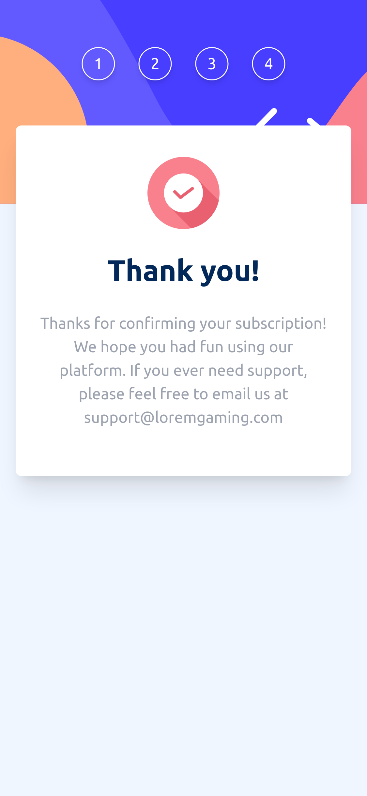
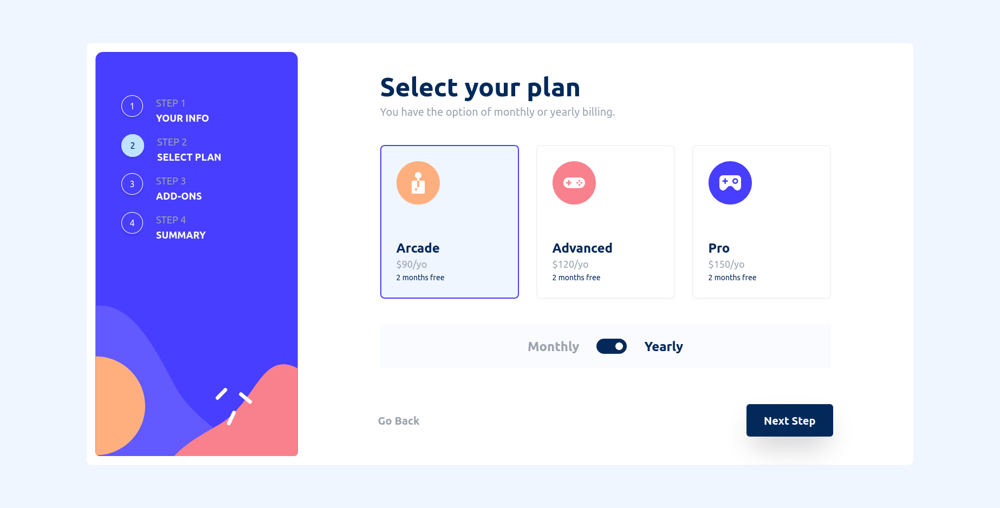

# Frontend Mentor - Multi-step form solution

This is a solution to
the [Multi-step form challenge on Frontend Mentor](https://www.frontendmentor.io/challenges/multistep-form-YVAnSdqQBJ).
Frontend Mentor challenges help you improve your coding skills by building realistic projects.

## Table of contents

- [Overview](#overview)
    - [The challenge](#the-challenge)
    - [Screenshot](#screenshot)
    - [Links](#links)
- [My process](#my-process)
    - [Built with](#built-with)

- [Author](#author)

## Overview

### The challenge

Users should be able to:

- Complete each step of the sequence
- See a summary of their selections on the final step and confirm their order
- View the optimal layout for the interface depending on their device's screen size
- See hover and focus states for all interactive elements on the page

### Screenshot

#### Mobile View

#### Desktop View

### Links

- Solution
  URL: [https://github.com/ujjwalgarg100204/Frontend-Mentors-multi-step-form-solution](https://github.com/ujjwalgarg100204/Frontend-Mentors-multi-step-form-solution)
- Live Site
  URL: [https://ujjwalgarg100204.github.io/Frontend-Mentors-multi-step-form-solution/](https://ujjwalgarg100204.github.io/Frontend-Mentors-multi-step-form-solution/)

## My process

### Built with

- 
- 
- 
- Mobile-first workflow

## Author

- Website - [Ujjwal Garg](https://github.com/ujjwalgarg100204)
- Frontend Mentor - [@ujjwalgarg100204](https://www.frontendmentor.io/profile/ujjwalgarg100204)
- Instagram - [@ujjwalgarg100204](https://www.instagram.com/ujjwalgarg100204/)
